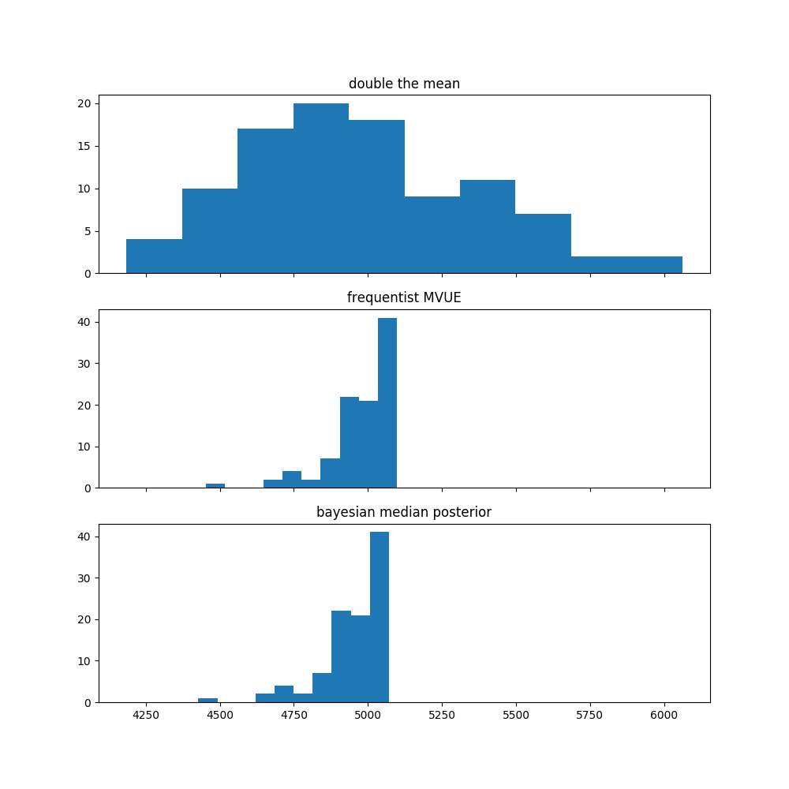

# German Tank Problem

I was asked about the [German Tank Problem](https://en.wikipedia.org/wiki/German_tank_problem) in an interview, and I got the question wrong, so I'm reviewing it for my own clarification here. The problem boils down to coming up with the minimum variance unbiased estimator (MVUE) for the population maximum of a discrete uniform distribution. The estimator that I came up with was to double the sample mean to estimate the population maximum. The frequentist MVUE is `m + m/k - 1` where m is the sample max and k in the number of samples. Intuitively, you can think of this as taking the sample max and then adding the average space between samples. 

The sample max m is also the maximum likelihood estimator for the population maximum, but it's biased. Any higher estimate would increase the support of the distribution and therefore lower the likelihood of all the observations. Adding the average space between the samples just adjusts the MLE for this bias.

For me it doesn't seem intuitive or obvious that this `m + m/k - 1` estimator is lower varaince than just doubling the sample mean. I created the script in this repo to simulate some german tank data and see how tightly these estimates cluster around the true value. In this simulation there are 5000 German tanks, from which we have a sample of 50. If we run this simulation 100 times and calculate three different estimates of the population maximum, we get the following distributions. I added in the bayesian estimate for the population max which ends up being very similar to the MVUE.

